# Informe Actividad 1.-

El alumnado trabajará por parejas: `alu1` y `alu2`
- `alu1` creará un repositorio público git-work en su cuenta de GitHub, añadiendo un `README.md` y una licencia MIT.
  - Mediante el uso del entorno gráfico de github, crearemos un nuevo repositorio con el nombre **"git-work"** marcando que esté en público, seleccionaremos de la lista la licencia MIT y haremos click en la opcion de crear README.md
 
<div align="center">
  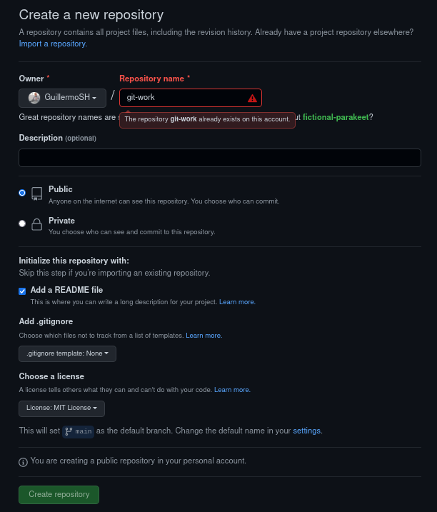
</div>

- `alu1` clonará el repo y añadirá los ficheros: index.html, bootstrap.min.css y cover.css. Luego subirá los cambios al upstream.
  - Para clonar el repositorio usaremos el siguiente comando `git clone` y la dirección del repositorio, en mi caso la url del repo. Luego, al añadir ya los ficheros deberemos subir los cambios al upstream. Para ello usaremos los siguientes comandos en el orden en el que están escritos. Esto llevará los cambios de tu rama main en local a tu upstream, tu rama main en remoto:
  ```
  $ git add .
  $ git commit -m "mensaje descriptivo del cambio"
  $ git push
  ```
  - Resultados:
 
<div align="center">
  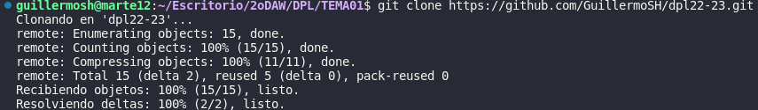
</div>
<div align="center">
  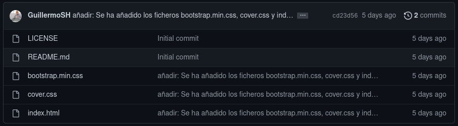
</div>

- `alu2` creará un fork de git-work desde su cuenta de GitHub.
  - Nos dirigimos al repositorio de `GuillermoSH/git-work` y en la parte superior derecha podemos encontrar este botón llamado "fork":

<div align="center">
  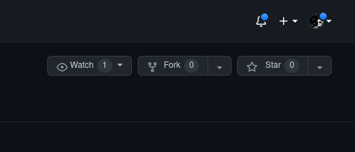
</div>
   
   - a continuación, rellenamos el formulario a completar:
 
<div align="center">
  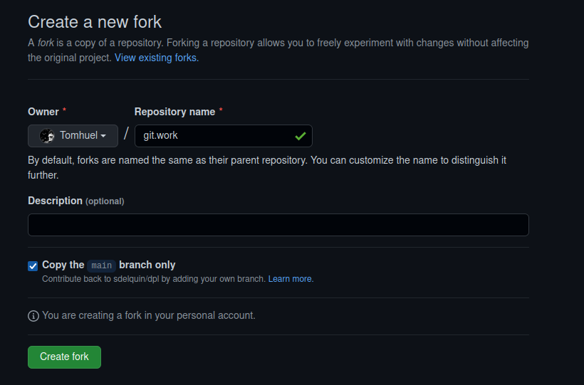
</div>

  - y con esto se nos quedaría una "copia" del repositorio de [GuillermoSH/git-work](https://github.com/GuillermoSH/git-work) como un nuevo repositorio [Tomhuel/git-work](https://github.com/Tomhuel/git-work) (en la captura aparece git.work porque ya tenía "forkeado" el repositorio y perdí la captura).


- `alu2` clonará su fork del repo.
  - Con un `git clone https://github.com/Tomhuel/git-work.git` se clonaría en local el repositorio que hicimos fork previamente:

<div align="center">
  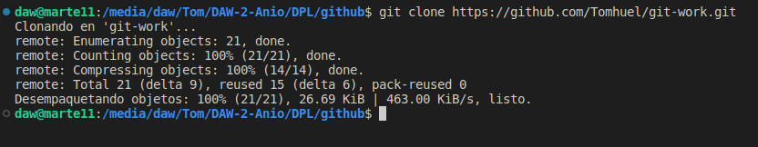
</div>

- `alu2` creará una nueva rama `custom-text` y modificará el fichero `index.html` personalizándolo para una supuesta startup.
  - Hacemos un `git switch -c custom-text`.

- `alu2` enviará un PR a `alu2`.
  - Nos situamos en la rama `custom-text` y hacemos un `git add .` o también un `git add index.html`. A continuación, realicé un `git commit -m "index.html cambiado"`. Después hice un `git push --set-upstream origin custom-text`. Después fui al repositorio de `GuillermoSH/git-work` y realicé un PR:

<div align="center">
  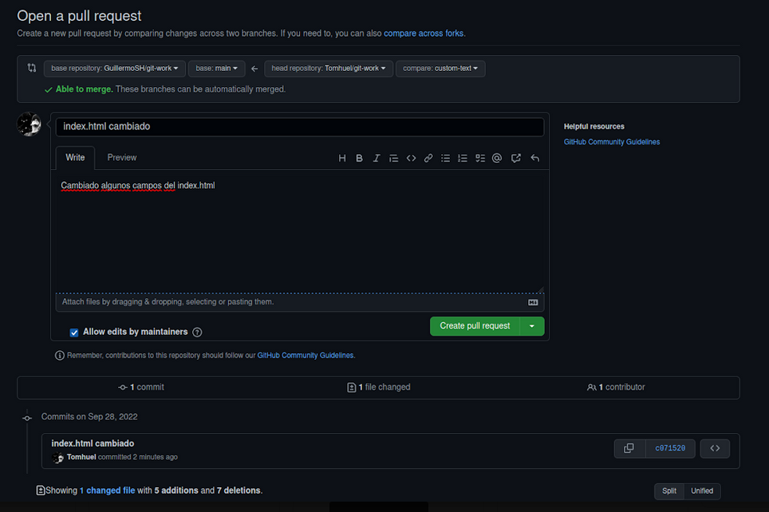
</div>

- `alu1` probará el PR de `alu2` en su máquina, y propondrá ciertos cambios que deberá subir al propio PR.
  - Lo primero que debemos hacer es bajarnos los cambios hechos por `alu2` para poder comprobarlos en local. Para ello usaremos los comandos `git remote`, `git fetch` y `git switch` de la siguiente manera:
 
<div align="center">
  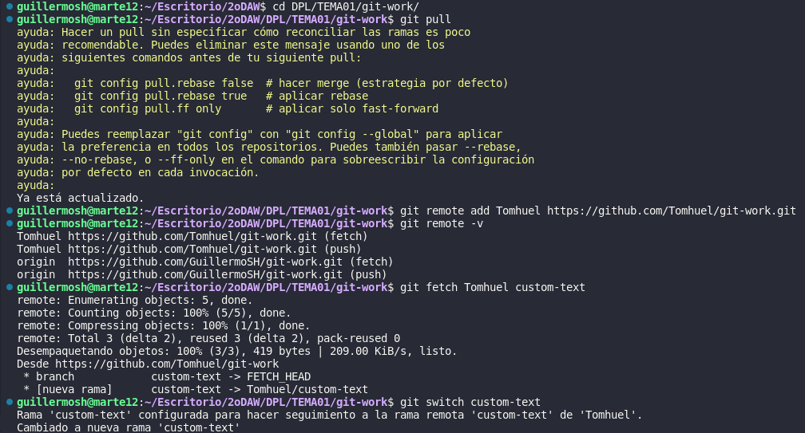
</div>

  - Luego al probar los cambios, se propusieron otros cambios al html previamente modificado:
 
<div align="center">
  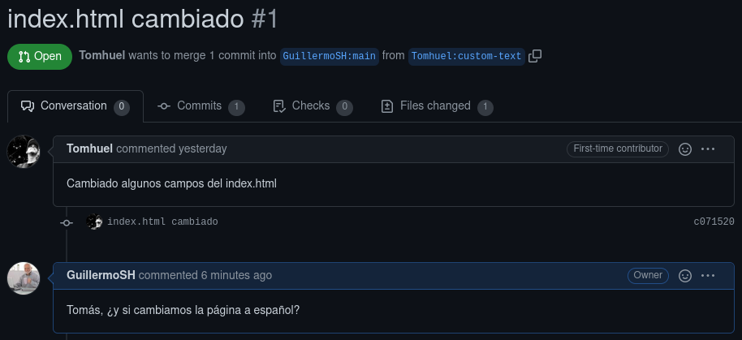
</div>

  - Más tarde, tras @Tomhuel haber hecho los cambios oportunos volvemos a actualizar nuestra rama con los cambios realizados. En mi caso, tuve un pequeño conflicto con los archivos en local ya que sin darme cuenta habia modificado el archivo index.html y tuve que restaurar la versión anterior para poder así traerme los nuevos cambios al local:
 
<div align="center">
  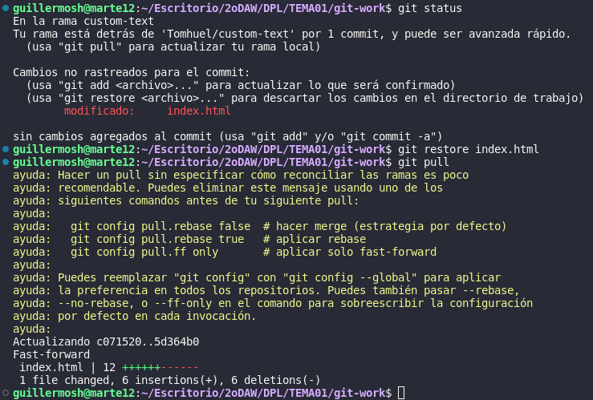
</div>

  - Una vez comprobados los cambios hechos por el otro alumno procederemos a subir los cambios al PR para poder después hacer merge con la rama main del repo:
 
<div align="center">
  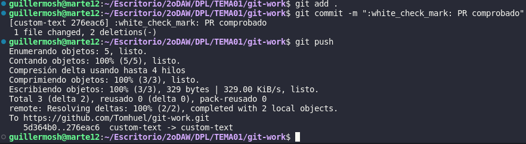
</div>

  - Cuando se haya subido esos cambios en el PR, deberemos ir de nuevo a la página de GitHub y desde ahí, en el apartado de PR confirmar el merge pull request:
 
<div align="center">
  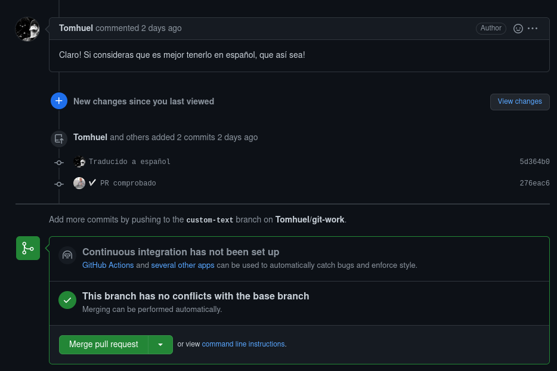
</div>
<div align="center">
  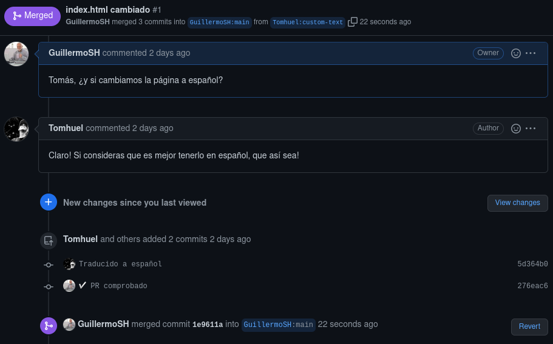
</div>

- `alu1` cambiará la línea 10 de `cover.css` a:
```
color: purple
```

<div align="center">
  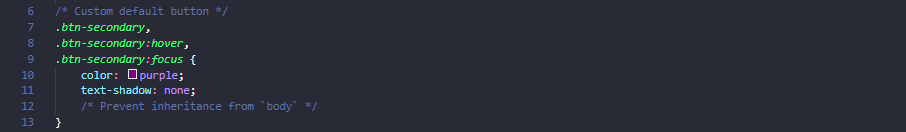
</div>

- `alu1` hará simplemente un commit local en main.
  - Para ello simplemente haremos un `git add .` y un `git commit -m "mensaje"` para dejarlo en local sin subirlo al remoto.
<div align="center">
  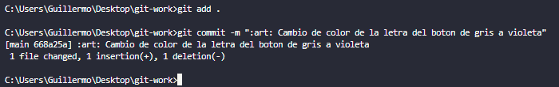
</div>


- `alu2` creará una nueva rama cool-colors y cambiará la línea 10 de cover.css a: color: darkgreen;
  - Primero, tenemos que hacer un `git switch -c cool-colors`. Una vez ahí cambiamos el código.
  - Ya después le hice un push a la rama remota para poder hacer el PR en el siguiente apartado:

<div align="center">
  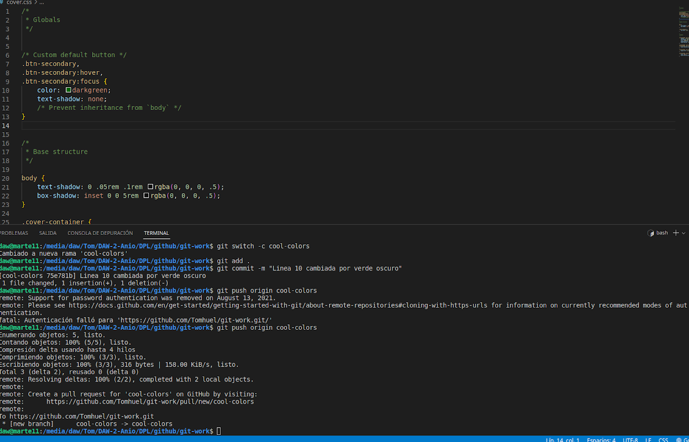
</div>

- `alu2` enviará un PR a `alu1`.

<div align="center">
  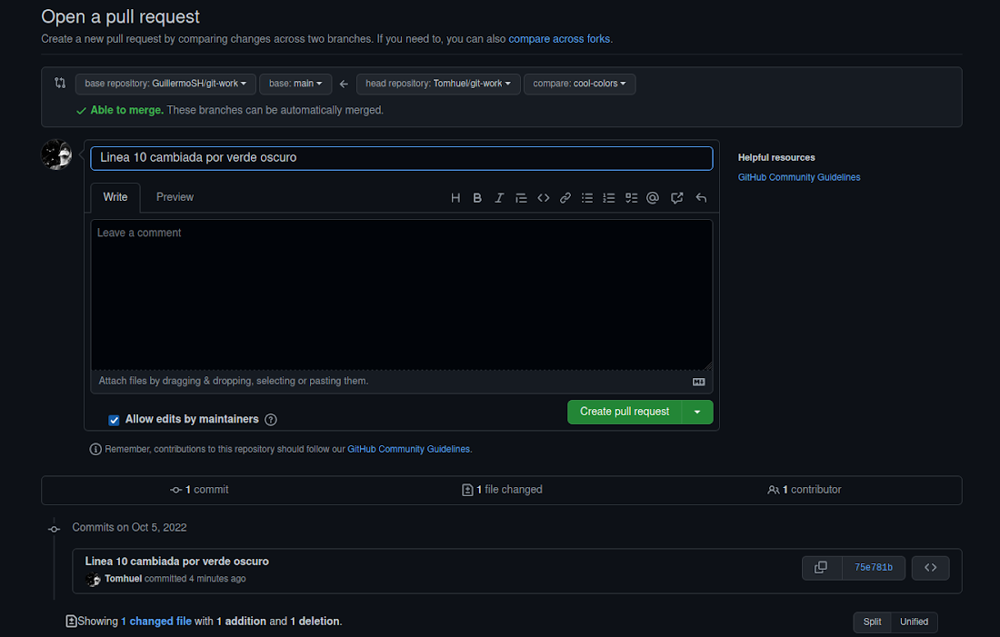
</div>

- `alu1` probará el PR de `alu2` y tendrá que gestionar el posible conflicto al mergear en la rama principal.
- `alu1` etiquetará esta versión como `0.1.0` y creará una "release" en GitHub apuntando a esta etiqueta.
  - Como hicimos en el PR anterior, de nuevo haremos un remote add y el repositorio objetivo, un fetch a la rama `cool-colors` y nos cambiaremos a ella para probar el PR:
 
<div align="center">
  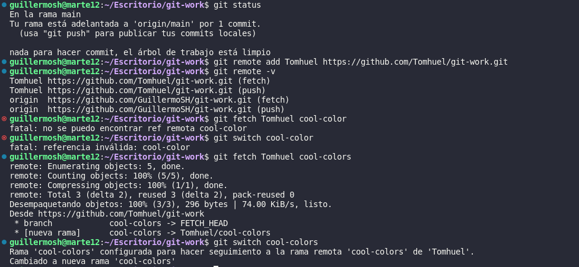
</div>

  - Al hacer un merge desde main a la rama cool-colors se nos presenta el siguiente conflicto, el cuál hemos resuelto cambiando a `color: darkgreen`. Luego, se haría la etiqueta `0.1.0` y se haría un push de los commits hechos al upstream con `$ git push --follow-tags`. Estos fueron los resultados:

<div align="center">
  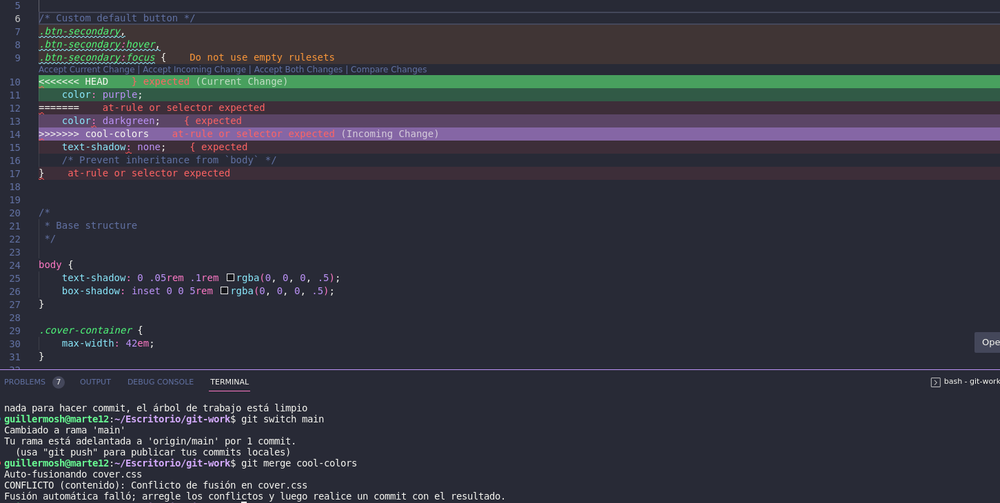
</div>
<div align="center">
  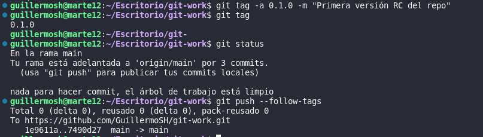
</div>

  - Finalmente, solo nos quedaría confirmar que se ha mergeado el PR en el main de nuestro repositorio, que se ha subido la etiqueta y crear la release:
 
<div align="center">
  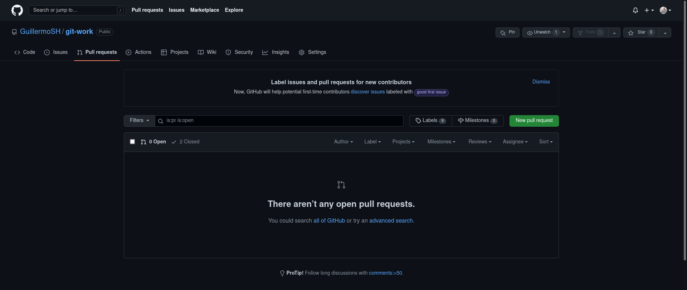
</div>
<div align="center">
  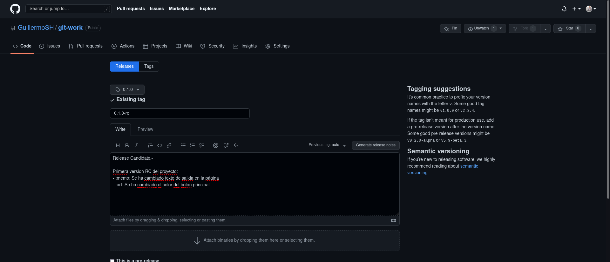
</div>
