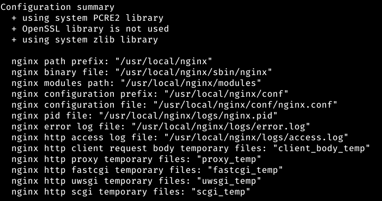

# Administración de Servidores Web

## Índice:

1. [Instalación](#instalación-del-módulo-ngx_small_light) del módulo [ngx_small_light](https://github.com/cubicdaiya/ngx_small_light) y cargarlo dinámicamente al servidor.
2. Creación de un [Virtual Host](#creación-del-virtual-host) que atiende peticiones en el dominio [images.alu7410.arkania.es](https://images.alu7410.arkania.es).
3. Creación de una [aplicación web](#aplicación-web) en JavaScript para tratar unas [imágenes predefinidas](https://github.com/Tomhuel/dpl22-23/tree/main/UT3/TE3/img).
4. [Redirigir](#redirecciones) el subdominio `www` al dominio base (en el puerto SSL). 
5. Incorporación del [certificado de seguridad CertBot](#certificación-de-seguridad).

___

## Instalación del módulo ngx_small_light

El módulo [ngx_small_light](https://github.com/cubicdaiya/ngx_small_light) es una herramienta para poder manipular las imágenes, con utilidades como redimensionar, rotar, bordear, cambio de formato de imágenes, ...

Este módulo lo queremos instalar dinámicamente para nuestra aplicación JavaScript, que va a trabajar con los bordes de las imágenes.

Inicialmente, debemos descargar el código fuente con la misma versión que tenemos instalada en el sistema, para posteriormente compilarlo junto al módulo:

```
curl -sL https://nginx.org/download/nginx-$(/sbin/nginx -v \|& cut -d '/' -f2).tar.gz | tar xvz -C /tmp #Lo pondremos en la carpeta temporal
```


El módulo de ngx_small_light tiene ciertas dependencias que requiere tenerlas instaladas previamente. Las dependencias que no tenemos isntaladas son la de ImageMagik y la de PCRE. Las instalaremos con el siguiente comando:

```
sudo apt install -y build-essential imagemagick libpcre3 libpcre3-dev libmagickwand-dev
```

Pero primero haremos un `sudo apt update`


y posteriormente instalamos las dependencias:


Una vez las pdependencias instaladas, proseguiremos con la instalación del código fuente del módulo con el siguiente comando:

```
git clone https://github.com/cubicdaiya/ngx_small_light.git
```


Ahora nos dirigimos a la carpeta del repositorio de Nginx Small Lights y haremos un setup con el comando:

```
./setup
```


Anteriormente, descargamos el código fuente de Nginx en la carpeta `/tmp`, por tanto, debemos dirigirnos ahí para poder añadir el módulo con el comando:

```
./configure --add-dynamic-module=/home/tomasantela/ngx_small_light
```


Devolviéndonos al final esta salida:



Posteriormente a la adición del módulo, generaremos una librería dinámica:

```
make modules
```


Ahora copiaremos la librería a la carpeta de módulos de la que Nginx consulta:

```
sudo cp objs/ngx_http_small_light_module.so /etc/nginx/modules
```


Ahora debemos modificar el fichero de configuración de Nginx `/etc/nginx/nginx.conf`, añadiendole a este un:

```
load_module /etc/nginx/modules/ngx_http_small_light_module.so;
```


Ahora tendríamos que tener creado un [Virtual Host](#creación-del-virtual-host) donde añadir las directivas de ngx_small_light

// PENDIENTE

___

## Creación del Virtual Host


___

## Aplicación web

___

## Redirecciones

___

## Certificación de Seguridad


[Volver al Inicio](#administración-de-servidores-web)