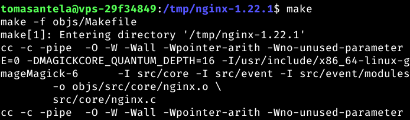
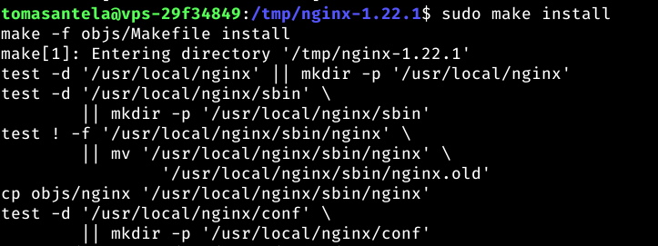

# Administración de Servidores Web

## Índice:

1. [Instalación](#instalación-del-módulo-ngx_small_light) del módulo [ngx_small_light](https://github.com/cubicdaiya/ngx_small_light) y cargarlo dinámicamente al servidor.
2. Creación de un [Virtual Host](#creación-del-virtual-host) que atiende peticiones en el dominio [images.alu7410.arkania.es](https://images.alu7410.arkania.es).
3. Creación de una [aplicación web](#aplicación-web) en JavaScript para tratar unas [imágenes predefinidas](https://github.com/Tomhuel/dpl22-23/tree/main/UT3/TE3/img).
4. [Redirigir](#redirecciones) el subdominio `www` al dominio base (en el puerto SSL). 
5. Incorporación del [certificado de seguridad CertBot](#certificación-de-seguridad).

___

## Instalación del módulo ngx_small_light

El módulo [ngx_small_light](https://github.com/cubicdaiya/ngx_small_light) es una herramienta para poder manipular las imágenes, con utilidades como redimensionar, rotar, bordear, cambio de formato de imágenes, ...

Este módulo lo queremos instalar dinámicamente para nuestra aplicación JavaScript, que va a trabajar con los bordes de las imágenes.

Inicialmente, debemos descargar el código fuente con la misma versión que tenemos instalada en el sistema, para posteriormente compilarlo junto al módulo:

<div align="center">

```
curl -sL https://nginx.org/download/nginx-$(/sbin/nginx -v |& cut -d '/' -f2).tar.gz | tar xvz -C /tmp #Lo pondremos en la carpeta temporal
```


</div>

El módulo de ngx_small_light tiene ciertas dependencias que requiere tenerlas instaladas previamente. Las dependencias que no tenemos isntaladas son la de ImageMagik y la de PCRE. Las instalaremos con el siguiente comando:

<div align="center">

```
sudo apt install -y build-essential imagemagick libpcre3 libpcre3-dev libmagickwand-dev
```

</div>

Pero primero haremos un `sudo apt update`

<div align="center">


</div>

y posteriormente instalamos las dependencias:

<div align="center">


</div>

Una vez las pdependencias instaladas, proseguiremos con la instalación del código fuente del módulo con el siguiente comando:

<div align="center">

```
git clone https://github.com/cubicdaiya/ngx_small_light.git
```


</div>

Ahora nos dirigimos a la carpeta del repositorio de Nginx Small Lights y haremos un setup con el comando:

<div align="center">

```
./setup
```


</div>

Anteriormente, descargamos el código fuente de Nginx en la carpeta `/tmp`, por tanto, debemos dirigirnos ahí para poder añadir el módulo con el comando:

<div align="center">
```
./configure --modules-path=/usr/local/nginx/modules --add-dynamic-module=/home/tomasantela/ngx_small_light
```


</div>

Devolviéndonos al final esta salida:


<div align="center">


</div>

Posteriormente a la adición del módulo, compilamos el módulo:

<div align="center">

```
make
```



</div>

Y lo instalamos:

<div align="center">

```
sudo make install
```



</div>

Ahora copiaremos la librería a la carpeta de módulos de la que Nginx consulta:


```
sudo cp objs/ngx_http_small_light_module.so /etc/nginx/modules
```


</div>

Ahora debemos modificar el fichero de configuración de Nginx `/etc/nginx/nginx.conf`, añadiendole a este un:

```
load_module /etc/nginx/modules/ngx_http_small_light_module.so;
```


</div>

Ahora tendríamos que tener creado un [Virtual Host](#creación-del-virtual-host) donde añadir las directivas de ngx_small_light, ya que nos dirigiremos al archivo .conf del virtual host que queramos implementar las directivas del módulo:

```

```

</div>

___

## Creación del Virtual Host

Nginx se configura a partir de bloques del servidor. Estos bloques son los Virtual Hosts, que son capaces de montar servicios independientes entre ellos.

Estos hosts virtuales se definen mediante unos ficheros `nombreQueQueramos.conf` dentro de la carpeta `/etc/nginx/conf.d/`

Nosotros haremos un virtual host con la dirección [images.alu7410.arkania.es](https://images.alu7410.arkania.es)

Primero, debemos crear un fichero `.conf` en la carpeta de `/etc/ngix/conf.d/`. Yo haré un fichero que se llamará `ngx_small_light.conf`:

Para crear el fichero, debemos directamente editar un fichero que no exista en la carpeta:

```
sudo vi /etc/nginx/conf.d/ngx_small_lights.conf 

# Otra opción

sudo nano -l /etc/nginx/conf.d/ngx_small_lights.conf # El parámetro -l enseña las líneas en el editor
```


queremos que el servername

```
server {
	server_name #nombre del server;
	root #ruta del fichero;
}
```


y comprobamos que tengamos la sintaxis correctamente:

```
sudo nginx -t
```


___

## Aplicación web

___

## Redirecciones

___

## Certificación de Seguridad


[Volver al Inicio](#administración-de-servidores-web)