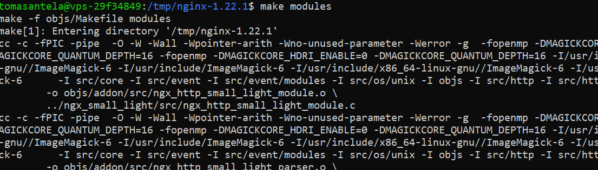

# Administración de Servidores Web

## Índice:

1. [Instalación](#instalación-del-módulo-ngx_small_light) del módulo [ngx_small_light](https://github.com/cubicdaiya/ngx_small_light) y cargarlo dinámicamente al servidor.
2. Creación de un [Virtual Host](#creación-del-virtual-host) que atiende peticiones en el dominio [images.alu7410.arkania.es](https://images.alu7410.arkania.es).
3. Creación de una [aplicación web](#aplicación-web) en JavaScript para tratar unas [imágenes predefinidas](https://github.com/Tomhuel/dpl22-23/tree/main/UT3/TE3/img).
4. [Redirigir](#redirecciones) el subdominio `www` al dominio base (en el puerto SSL). 
5. Incorporación del [certificado de seguridad CertBot](#certificación-de-seguridad).

___

## Instalación del módulo ngx_small_light

El módulo [ngx_small_light](https://github.com/cubicdaiya/ngx_small_light) es una herramienta para poder manipular las imágenes, con utilidades como redimensionar, rotar, bordear, cambio de formato de imágenes, ...

Este módulo lo queremos instalar dinámicamente para nuestra aplicación JavaScript, que va a trabajar con los bordes de las imágenes.

Inicialmente, debemos descargar el código fuente con la misma versión que tenemos instalada en el sistema, para posteriormente compilarlo junto al módulo:

```
curl -sL https://nginx.org/download/nginx-$(/sbin/nginx -v |& cut -d '/' -f2).tar.gz | tar xvz -C /tmp #Lo pondremos en la carpeta temporal
```

<div align="center">


</div>

El módulo de ngx_small_light tiene ciertas dependencias que requiere tenerlas instaladas previamente. Las dependencias que no tenemos isntaladas son la de ImageMagik y la de PCRE. Las instalaremos con el siguiente comando:

```
sudo apt install -y build-essential imagemagick libpcre3 libpcre3-dev libmagickwand-dev
```

Pero primero haremos un `sudo apt update`

<div align="center">


</div>

y posteriormente instalamos las dependencias:

<div align="center">


</div>

Una vez las pdependencias instaladas, proseguiremos con la instalación del código fuente del módulo con el siguiente comando:

```
git clone https://github.com/cubicdaiya/ngx_small_light.git
```

<div align="center">


</div>

Ahora nos dirigimos a la carpeta del repositorio de Nginx Small Lights y haremos un setup con el comando:

```
./setup
```

<div align="center">


</div>

Anteriormente, descargamos el código fuente de Nginx en la carpeta `/tmp`, por tanto, debemos dirigirnos ahí para poder añadir el módulo con el comando (aclarar que me tomó varios intentos porque estaba usando el de la propia documentación de ngx_small_light, que me daba problemas,  de ahí que la captura esté en CMD y que la carpeta del repositorio clonado esté en /tmp):

```
./configure --add-dynamic-module=../ngx_small_light --with-compat
```

<div align="center">


</div>

Posteriormente a la adición del módulo, generamos una librería:

```
make modules
```

<div align="center">



</div>

Ahora copiaremos la librería a la carpeta de módulos de la que Nginx consulta:

```
sudo cp objs/ngx_http_small_light_module.so /etc/nginx/modules
```


</div>

Ahora debemos modificar el fichero de configuración de Nginx `/etc/nginx/nginx.conf`, añadiendole a este un:

```
load_module /etc/nginx/modules/ngx_http_small_light_module.so;
```


</div>

Ahora tendríamos que tener creado un [Virtual Host](#creación-del-virtual-host) donde añadir las directivas de ngx_small_light, ya que nos dirigiremos al archivo .conf del virtual host que queramos implementar las directivas del módulp. En mi caso es un archivo llamado ngx_small_light.conf

```
# Añadiremos el siguiente contenido:

location /files {
        alias /etc/nginx;
		small_light on; # Habilita el uso del módulo
		small_light_getparam_mode on; # Habilita poder llamar al módulo mediante parámetros
    }
```

<div align="center">


</div>

Y ya para quedarnos tranquilos de que todo fue correctamente, hacemos un:

```
sudo nginx -t
```

<div align="center">


</div>

___

## Creación del Virtual Host

Nginx se configura a partir de bloques del servidor. Estos bloques son los Virtual Hosts, que son capaces de montar servicios independientes entre ellos.

Estos hosts virtuales se definen mediante unos ficheros `nombreQueQueramos.conf` dentro de la carpeta `/etc/nginx/conf.d/`

Nosotros haremos un virtual host con la dirección [images.alu7410.arkania.es](https://images.alu7410.arkania.es)

Primero, debemos crear un fichero `.conf` en la carpeta de `/etc/ngix/conf.d/`. Yo haré un fichero que se llamará `ngx_small_light.conf`:

Para crear el fichero, debemos directamente editar un fichero que no exista en la carpeta:

```
sudo vi /etc/nginx/conf.d/ngx_small_lights.conf 

# Otra opción

sudo nano -l /etc/nginx/conf.d/ngx_small_lights.conf # El parámetro -l enseña las líneas en el editor
```


queremos que el servername

```
server {
	server_name #nombre del server;
	root #ruta del fichero;
}
```


y comprobamos que tengamos la sintaxis correctamente:

```
sudo nginx -t
```

<div align="center">


</div>

A continuación, generaremos un fichero index en la ruta que hemos indicado en el `.conf` del virtual Host, en nuestro caso, en `/home/tomasantela/dev/ngx_small_lightJS`

El contenido del fichero será el siguiente:

```
<!DOCTYPE html>
<html lang="es">
<head>
    <meta charset="UTF-8">
    <meta name="viewport" content="width=device-width, initial-scale=1.0">
    <title>Nginx + ngx_small_light</title>
    <link href="estilos.css" type="text/css" rel="stylesheet">
</head>
<body>
    <div class="container">
        <div class="header">

        </div>
        <div class="main">
            
        </div>
        <div class="footer">

        </div>
    </div>
    <script src="imagenesDinamicas.js"></script>
</body>
</html>
```


Posterior a crear el `index.html` hacemos un reload del servicio de Nginx para confirmar los cambios:

```
sudo systemctl reload nginx
```


Nos faltaría simular un nombre de dominio de manera local en el archivo `/etc/hosts`


Ya podría entrar al index.html que tengo ahí desde otro dispositivo, por ejemplo desde mi portátil en un navegador Opera:


Podemos ver que el título de la web es el que pusimos en el html, por tanto, está funcionando correctamente.

___

## Aplicación web

Muy bien, ahora a desarrollar código.

El html y el css no le voy a dar mucha relevancia. 
Lo más relevante será la clase `.hide` en el css y la estructuración para llegar hasta las imágenes que se conformaría de lo siguiente:


Por tanto, para acceder al bloque de html donde tenemos todas las imágenes, tendríamos que acceder desde el document:

```
document -> body -> div.container -> div.main -> div.imagenes
```

El código JavaScript sería el siguiente:

```
/**
 * Metodo que modifica las imagenes segun los parametros introducidos, 
 * ademas de quitarles la clase hide para que ya no esten ocultas
 * @param {int} tamanio ancho y alto de la imagen
 * @param {int} borderWidth grosor del borde de la imagen
 * @param {string} borderColor color del borde de la imagen
 * @param {int} enfoqueRadio radio de enfoque
 * @param {int} desenfoqueRadio radio de desenfoque
 * @param {int} enfoqueMount cantidad de enfoque
 * @param {int} desenfoqueMount cantidad de desenfoque
 */
function modificarImagenes (tamanio, borderWidth, borderColor, enfoqueRadio, desenfoqueRadio, enfoqueMount, desenfoqueMount) {
    const imagenes = document.body.children['container'].children['main'].children['imagenes'];
    const totalImagenes = imagenes.childElementCount;
    for (let i=0; i<totalImagenes; i++) {
        imagenes.children[i].classList.remove("hide");
        imagenes.children[i].src = `./img/${imagenes.children[i].name}.jpg?bw=${borderWidth}&bc=${borderColor}&dh=${tamanio}&dw=${tamanio}&sharpen=${enfoqueRadio}x${enfoqueMount}&blur=${desenfoqueRadio}x${desenfoqueMount}`;
    }
}

/**
 * Metodo que es llamado al pulsar el boton "generar" del html. Este metodo recoge los datos necesarios del formulario y llama
 * al metodo modificarImagenes() para modificar las imagenes del html
 */
function imagenesDinamicas () {
    let tamanio = getValorElemento("size");
    let borderWidth = getValorElemento("width");
    let borderColor = getValorElemento("color");
    let enfoqueRadio = getValorElemento("focus");
    let desenfoqueRadio = getValorElemento("nofocus");
    let enfoqueMount = getValorElemento("focusMount");
    let desenfoqueMount = getValorElemento("nofocusMount");
    modificarImagenes(tamanio, borderWidth, borderColor, enfoqueRadio, desenfoqueRadio, enfoqueMount, desenfoqueMount);
}

/**
 * Metodo que devuelve el valor del objeto del html con el id deseado
 * @param {String} id del elemento del html deseado
 * @returns String
 */
function getValorElemento(id) {
    return document.getElementById(id).value;
}
```

| Método | Parámetros | Returns | Descripción |
|-|-|-|-|
| modificarImagenes | tamanio (int), borderWidth (int), borderColor (String), enfoqueRadio (int), desenfoqueRadio (int), enfoqueMount (int), desenfoqueMount (int) |  |  Método que modifica las imágenes según los parámetros introducidos además de quitarles la clase hide para que ya no estén ocultas |
| imagenesDinamicas (main) | | | Método que es llamado al pulsar botón "generar" del html. Este método recoge los datos necesarios del formulario y llama al método modificarImagenes() para modificar las imágenes del html |
| getValorElemento | id (String) | String | Método que devuelve el valor del objeto del html con el id deseado |

Si nos fijamos en el método modificarImagenes() podemos ver que accede al contenedor de imagenes con el `document.body.children['container'].children['main'].children['imagenes'];`.

Ya el método lo que hace es recorrer todos los nodos hijos del bloque div.imagenes y cambia el src con los parámetros introducidos.

La clase `.hide` es simplemente para que cuando entres por primera vez a la web, estén las imágenes ocultas. Ya el método modificarImagenes las pondrá visibles.

Ya finalmente solo nos faltaría subir los archivos `index.html`, `imagenesDinamicas.js`, `estilos.css` y la carpeta `/img/` al ordenador remoto de alu7410.arkania.es en la carpeta `/home/tomasantela/dev/ngx_small_lightJS`.


___

## Redirecciones

___

## Certificación de Seguridad


[Volver al Inicio](#administración-de-servidores-web)