# UT4-TE1 Administración de Servidores Web (PostgreSQL)

## Índice:

1. [Instalación](#instalación-de-postgresql-y-pgadmin) de PostgreSQL y pgAdmin.
    - Instalación [PostgreSQL](#instalación-de-postgresql)
    - [Carga de datos](#carga-de-datos-a-base-de-datos) a las bases de datos
    - Instalación [pgAdmin](#instalación-pgadmin)
    - Include de [_config.php_](#include-configphp)

2. [Aplicación PHP](#aplicación-php-entorno-de-desarrollo)
    - [Entorno de Desarrollo](#aplicación-php-entorno-de-desarrollo)
        - [Instalación de extensión](#instalación-extensión-postgresql-para-php-fpm) PostgreSQL para PHP-FPM
        - Desarrollo de [Aplicación](#desarrollo-de-la-aplicación)
        - Utilización dominio [php.travelroad.local](#utilización-del-dominio-phptravelroadlocal)
        - Include de [_config.php_](#include-de-configphp)
    - [Entorno de Producción](#aplicación-php-entorno-de-producción)
        - [Clonar repositorio](#clonar-repositorio-a-máquina-de-producción) a máquina de producción
        - Incluir fichero [_config.php_](#incluir-fichero-configphp-configurado-a-producción) con las credenciales de la base de datos de la máquina de producción
        - Configuración [Virtual Host](#configuración-virtual-host)
        - [Certificación](#certificación-y-redirección-www) y redirección www

3. [Despliegue](#despliegue)
    - [Script](#script-deploysh) [deploy.sh]() para actualizar los cambios a la máquina de producción desde la de desarrollo
    - [Testeo](#testeo-del-script) del Script

___

## Instalación de PostgreSQL y pgAdmin

En esta sección nos encargaremos de dejar instaladas las herramientas necesarias poara poder trabajar con una base de datos.

### Instalación de PostgreSQL

Usaremos una base de datos de PostgreSQL, una base de datos relacional bastante puntera.

Para empezar la instalación de PostgreSQL, primeramente debemos hacer una actualización de los paquetes:

```
sudo apt update
```

<div align='center'>

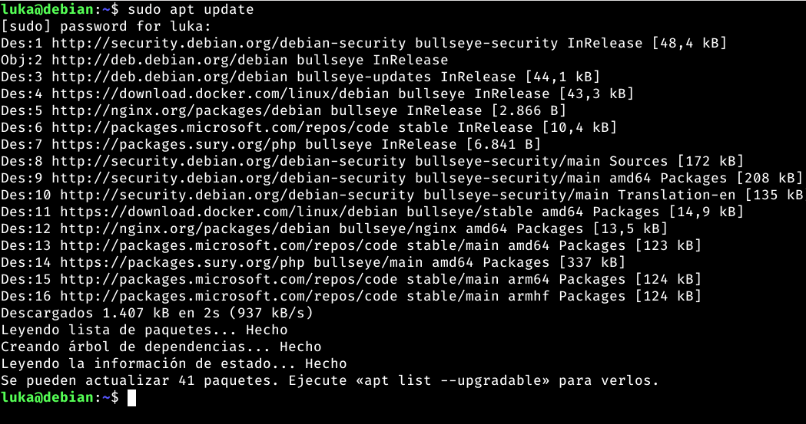

</div>

E instalaremos unos paquetes de soporte necesarios para PostgreSQL:

```
sudo apt install -y apt-transport-https
```

<div align='center'>

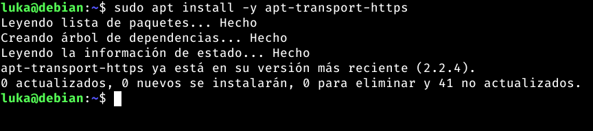

</div>

Descargamos la clave firma del repo oficial de PostgreSQL: 

```
curl -fsSL https://www.postgresql.org/media/keys/ACCC4CF8.asc | sudo gpg --dearmor -o /etc/apt/trusted.gpg.d/postgresql.gpg
```

<div align='center'>

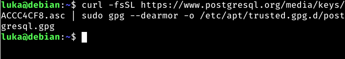

</div>

Añadimos el repositorio oficial a la lista de repositorios del sistema:

```
echo "deb http://apt.postgresql.org/pub/repos/apt/ $(lsb_release -cs)-pgdg main" | sudo tee /etc/apt/sources.list.d/postgresql.list > /dev/null
```

<div align='center'>

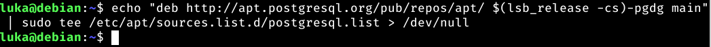

</div>

Y volveremos a actualizar el listado de paquetes:

```
sudo apt update
```

<div align='center'>

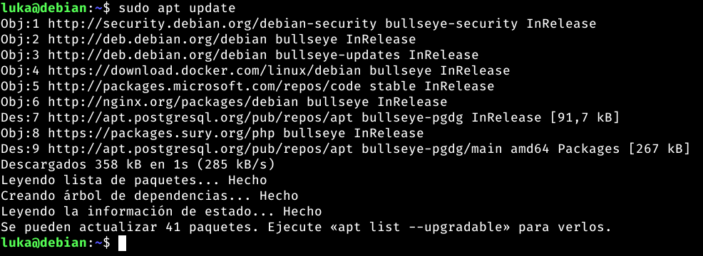

</div>

Comprobamos todas las versiones de PostgreSQL:

```
apt-cache search --names-only 'postgresql-[0-9]+$' | sort
```

<div align='center'>

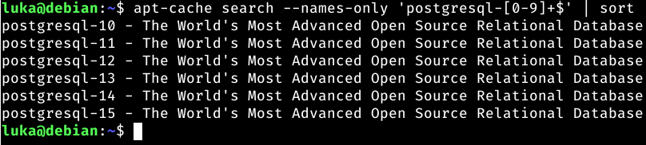

</div>

En mi caso la última versión disponible es la 15, por tanto, descargaré esa:

```
sudo apt install -y postgresql-15
```

<div align='center'>

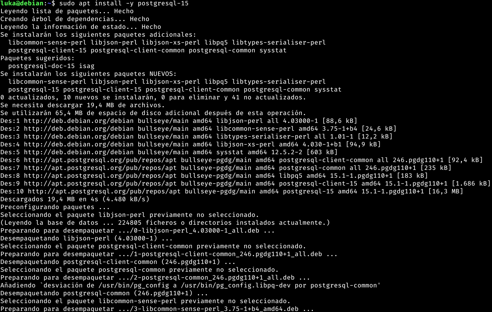

</div>


A continuación configuraremos un usuario (conocido dentro de PostgreSQL como rol) de PostgreSQL (en la máquina de producción ya tenemos un usuario configurado un usuario llamado travelroad_user)

El usuario que configuraré en la máquina de desarrollo será el usuario travelroad_local con la contraseña BeSmart1977.

Para ello primero debemos abrir la base de datos como usuario postgre:

```
sudo -u postgres psql
```

<div align='center'>

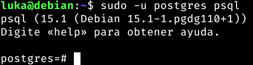

</div>

Lo siguiente sería poner esto dentro de la terminal de PostgreSQL con los datos que nosotros queramos:

`CREATE USER ${El nombre de usuario que queremos} WITH PASSWORD '${La contraseña que queremos}';`

En nuestro ejemplo sería algo tal que así:

```
CREATE USER travelroad_local WITH PASSWORD 'BeSmart1977';
```

<div align='center'>

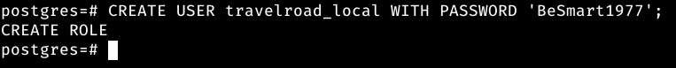

</div>

Y creamos la base de datos que queremos usar para el rol travelroad_local:

```
CREATE DATABASE travelroad WITH OWNER travelroad_local;
```

<div align='center'>

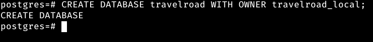

</div>

Ahora saldremos de PostgreSQL con un `exit` para entrar como travelroad_local:

```
psql -h localhost -U travelroad_local travelroad
```

<div align='center'>

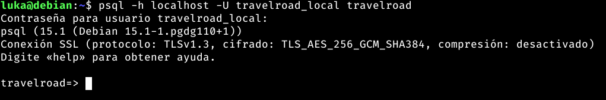

</div>

### Carga de datos a base de datos


### Instalación pgAdmin


### Include config.php


___

## Aplicación PHP (Entorno de Desarrollo)


### Instalación extensión PostgreSQL para PHP-FPM


### Desarrollo de la Aplicación


### Utilización del dominio [php.travelroad.local]()


### Include de config.php


## Aplicación PHP (Entorno de Producción)


### Clonar repositorio a máquina de producción


### Incluir fichero config.php configurado a producción


### Configuración Virtual Host


### Certificación y redirección www


___

## Despliegue


### Script _deploy.sh_


### Testeo del Script


___

<div align="center">

[Volver al inicio](#ut4-te1-administración-de-servidores-web-postgresql)

Trabajo realizado por [Tomás Nahuel Antela Rizzo](https://github.com/Tomhuel)

</div>