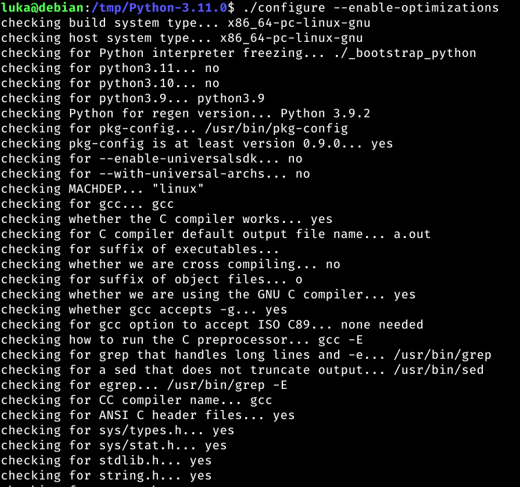
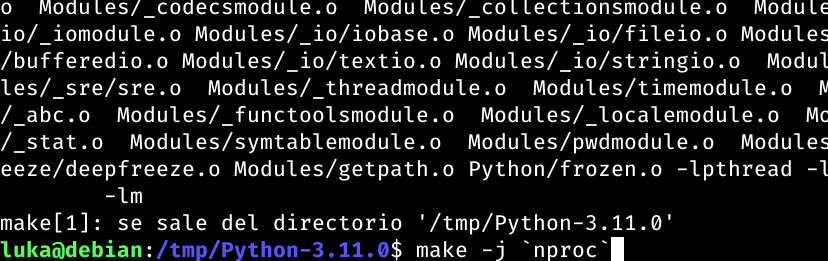
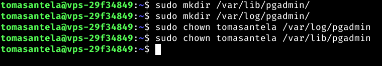

# UT4-TE1 Administración de Servidores Web (PostgreSQL)

## Índice:

1. [Instalación](#instalación-de-postgresql-y-pgadmin) de PostgreSQL y pgAdmin.
    - Instalación [PostgreSQL](#instalación-de-postgresql)
    - [Carga de datos](#carga-de-datos-a-base-de-datos) a las bases de datos
    - Instalación [pgAdmin](#instalación-pgadmin)
    - Include de [_config.php_](#include-configphp)

    [enlace](#índice)

2. [Aplicación PHP](#aplicación-php-entorno-de-desarrollo)
    - [Entorno de Desarrollo](#aplicación-php-entorno-de-desarrollo)
        - [Instalación de extensión](#instalación-extensión-postgresql-para-php-fpm) PostgreSQL para PHP-FPM
        - Desarrollo de [Aplicación](#desarrollo-de-la-aplicación)
        - Utilización dominio [php.travelroad.local](#utilización-del-dominio-phptravelroadlocal)
        - Include de [_config.php_](#include-de-configphp)
    - [Entorno de Producción](#aplicación-php-entorno-de-producción)
        - [Clonar repositorio](#clonar-repositorio-a-máquina-de-producción) a máquina de producción
        - Incluir fichero [_config.php_](#incluir-fichero-configphp-configurado-a-producción) con las credenciales de la base de datos de la máquina de producción
        - Configuración [Virtual Host](#configuración-virtual-host)
        - [Certificación](#certificación-y-redirección-www) y redirección www

3. [Despliegue](#despliegue)
    - [Script](#script-deploysh) [deploy.sh]() para actualizar los cambios a la máquina de producción desde la de desarrollo
    - [Testeo](#testeo-del-script) del Script

___

## Instalación de PostgreSQL y pgAdmin

En esta sección nos encargaremos de dejar instaladas las herramientas necesarias poara poder trabajar con una base de datos.

### Instalación de PostgreSQL

Usaremos una base de datos de PostgreSQL, una base de datos relacional bastante puntera.

Para empezar la instalación de PostgreSQL, primeramente debemos hacer una actualización de los paquetes:

```
sudo apt update
```

<div align='center'>


</div>

E instalaremos unos paquetes de soporte necesarios para PostgreSQL:

```
sudo apt install -y apt-transport-https
```

<div align='center'>


</div>

Descargamos la clave firma del repo oficial de PostgreSQL: 

```
curl -fsSL https://www.postgresql.org/media/keys/ACCC4CF8.asc | sudo gpg --dearmor -o /etc/apt/trusted.gpg.d/postgresql.gpg
```

<div align='center'>


</div>

Añadimos el repositorio oficial a la lista de repositorios del sistema:

```
echo "deb http://apt.postgresql.org/pub/repos/apt/ $(lsb_release -cs)-pgdg main" | sudo tee /etc/apt/sources.list.d/postgresql.list > /dev/null
```

<div align='center'>


</div>

Y volveremos a actualizar el listado de paquetes:

```
sudo apt update
```

<div align='center'>


</div>

Comprobamos todas las versiones de PostgreSQL:

```
apt-cache search --names-only 'postgresql-[0-9]+$' | sort
```

<div align='center'>


</div>

En mi caso la última versión disponible es la 15, por tanto, descargaré esa:

```
sudo apt install -y postgresql-15
```

<div align='center'>


</div>


A continuación configuraremos un usuario (conocido dentro de PostgreSQL como rol) de PostgreSQL (en la máquina de producción ya tenemos un usuario configurado un usuario llamado travelroad_user)

El usuario que configuraré en la máquina de desarrollo será el usuario travelroad_local con la contraseña BeSmart1977.

Para ello primero debemos abrir la base de datos como usuario postgre:

```
sudo -u postgres psql
```

<div align='center'>


</div>

Lo siguiente sería poner esto dentro de la terminal de PostgreSQL con los datos que nosotros queramos:

`CREATE USER ${El nombre de usuario que queremos} WITH PASSWORD '${La contraseña que queremos}';`

En nuestro ejemplo sería algo tal que así:

```
CREATE USER travelroad_local WITH PASSWORD 'BeSmart1977';
```

<div align='center'>


</div>

Y creamos la base de datos que queremos usar para el rol travelroad_local:

```
CREATE DATABASE travelroad WITH OWNER travelroad_local;
```

<div align='center'>


</div>

Ahora saldremos de PostgreSQL con un `exit` para entrar como travelroad_local:

```
psql -h localhost -U travelroad_local travelroad
```

<div align='center'>


</div>

### Carga de datos a base de datos

En mi caso, ya tengo los datos cargados en la base de datos de producción, por lo que me faltaría cargar los datos en la base de datos de desarrollo.

El archivo que usaremos para cargar la base de datos es el [places.csv](./src/BBDD/places.csv)

Primero tendremos que descargar este archivo csv, por lo que haremos lo guardaremos en la carpeta `/tmp`:

```
curl -o /tmp/places.csv https://raw.githubusercontent.com/sdelquin/dpl/main/ut4/files/places.csv
```

<div align='center'>


</div>

Previamente deberemos crear una tabla (crearé una tabla llamada places con los campos name y visited):

```
CREATE TABLE places(
id SERIAL PRIMARY KEY,
name VARCHAR(255),
visited BOOLEAN);
```

Usaremos la función COPY de PostgreSQL para copiar el archivo places.csv a la base de datos que queremos:

```
psql -h localhost -U travelroad_local -d travelroad -c "\copy places(name, visited) FROM '/tmp/places.csv' DELIMITER ','"
```

<div align='center'>


</div>

Con esto ya tendríamos los datos cargados, vamos a abrir sesión con travelroad_local para verificar que estén los datos cargados correctamente:

<div align='center'>


</div>

### Instalación pgAdmin

¿Qué es pgAdmin?

pgAdmin es una plataforma de código abierto para administrar tu Base de Datos en PostgreSQL mediante una interfaz. Esta está programada en Phyton y con un framework llamado Flask.

Instalaremos la plataforma de pgAdmin tanto en la máquina de producción como en la de desarrollo

Primero de todo instalaremos Python, y como este añade utilidades ejecutables en la línea de comandos, debemos asegurarnos que la ruta de binarios está en el PATH correspondiente:

```
echo 'export PATH=~/.local/bin:$PATH' >> .bashrc && source .bashrc
```

<div align='center'>

Máquina de desarrollo


Máquina de producción


</div>

Una vez nos hemos asegurado de tener la ruta de los binarios en el PATH correspondiente, instalaremos Python:

Actualizamos la lista de paquetes:

```
sudo apt update
```

<div align='center'>

Máquina de desarrollo


Máquina de producción


</div>

Tenemos unos prerequisitos previos para poder instalar Python, por tanto los instalaremos:

```
sudo apt install -y build-essential zlib1g-dev libncurses5-dev libgdbm-dev libnss3-dev libssl-dev libreadline-dev libffi-dev libsqlite3-dev wget libbz2-dev
```

<div align='center'>

Máquina de desarrollo


Máquina de producción


</div>

Ahora instalaremos la última versión disponible comprimida de Python, la descomprimimos y accederemos a la carpeta:

```
curl https://www.python.org/ftp/python/3.11.0/Python-3.11.0.tgz | tar xvz -C /tmp && cd /tmp/Python-3.11.0
```

<div align='center'>

Máquina de desarrollo


Máquina de producción


</div>

A continuación configuraremos la instalación:

```
./configure --enable-optimizations
```

<div align='center'>

Máquina de desarrollo



Máquina de producción


</div>

y compilaremos el intérprete:

```
make -j `nproc`
```

<div align='center'>

Máquina de desarrollo



Máquina de producción


</div>

Y ejecutamos la instalación de Python:

```
sudo make altinstall
```

<div align='center'>

Máquina de desarrollo


Máquina de producción


</div>

Hacemos que la nueva versión de Python sea la versión por defecto del sistema:

```
sudo update-alternatives --install /usr/bin/python python /usr/local/bin/python3.11 10
```

<div align='center'>

Máquina de desarrollo


Máquina de producción


</div>

Ahora instalaremos los paquetes adicionales para Python.

Nos aseguramos de tener la última versión del instalador de paquetes:

```
python -m pip install -U pip
```

<div align='center'>

Máquina de desarrollo


Máquina de producción


</div>


Instalaremos a continuación los siguientes paquetes:

black - Formateador de código Python

iPython - Consola interactiva de Python

wheel - Paquete de soporte para instalar otros paquetes

cowsay - API o script de consola para imprimir dibujos por terminal

```
pip install black ipython wheel cowsay
```

<div align='center'>

Máquina de desarrollo


Máquina de producción


</div>

Y con esto finalizamos la instalación de Phyton.

Ahora podremos proseguir con la instalación de pgAdmin:

Crearemos unas carpetas de trabajo con unos permisos adecuados:

```
sudo mkdir /var/lib/pgadmin | sudo mkdir /var/log/pgadmin
```

```
sudo chown $USER /var/lib/pgadmin | sudo chown $USER /var/lib/pgadmin
```

| Máquina de Desarrollo | Máquina de Producción |
| -- | -- |
|  |  |


Crearemos un entorno virtual de Python:

```
cd $HOME
python -m venv pgadmin4
source pgadmin4/bin/activate
```

E instalamos el paquete de pgadmin

```
pip install pgadmin4
```

<div align='center'>

| Máquina de desarrollo | Máquina de Producción |
| --  | -- |
|  |  |

</div>


### Include config.php


___

## Aplicación PHP (Entorno de Desarrollo)


### Instalación extensión PostgreSQL para PHP-FPM


### Desarrollo de la Aplicación


### Utilización del dominio [php.travelroad.local]()


### Include de config.php


## Aplicación PHP (Entorno de Producción)


### Clonar repositorio a máquina de producción


### Incluir fichero config.php configurado a producción


### Configuración Virtual Host


### Certificación y redirección www


___

## Despliegue


### Script _deploy.sh_


### Testeo del Script


___

<div align="center">

[Volver al inicio](#ut4-te1-administración-de-servidores-web-postgresql)

Trabajo realizado por [Tomás Nahuel Antela Rizzo](https://github.com/Tomhuel)

</div>