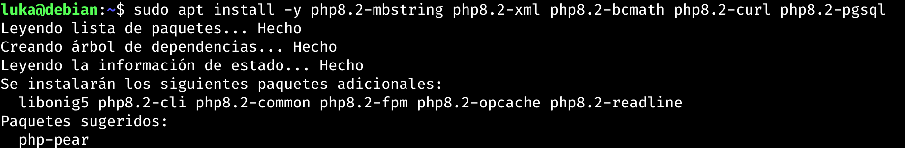
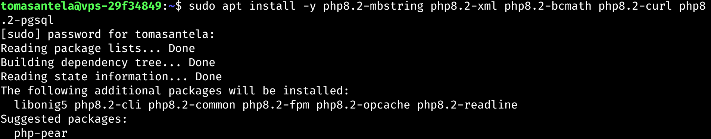
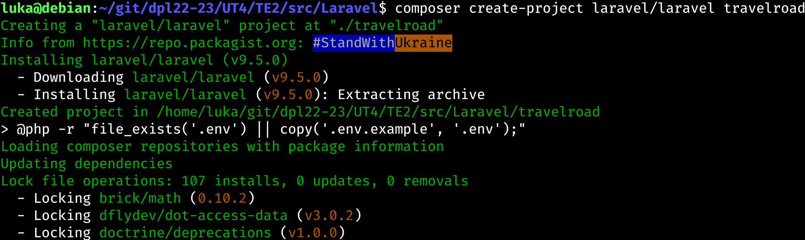
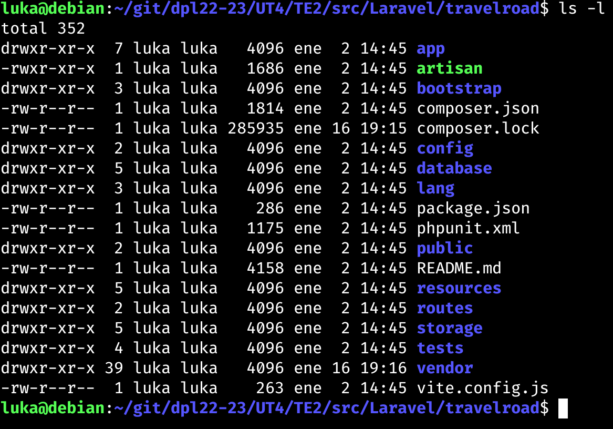
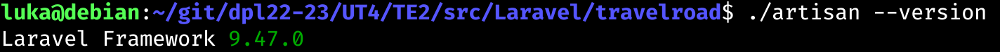

# UT4-TE2: Administración de servidores web
___

## Índice:

1. Laravel
    - a
    - a
2. Express
    - a
    - a
3. Spring
    - a
    - a
4. Ruby on Rails
    - a
    - a
5. Django
    - a
    - a

___

## TE2.1 LARAVEL

<div align='center'>


</div>

Laravel es un framework web de código abierto para desarrollar aplicaciones y servicios web con PHP.

### Instalar Composer

Primero deberemos instalar un gestor de dependencias para PHP, Composer:

<div align='center'>

Máquina de Desarrollo


Máquina de Producción


</div>

### Instalar Paquetes de Soporte

Debemos hacer un `sudo apt update`.

Tendremos que instalar unos paquetes de soporte para poder habilitar algunos módulos PHP en el sistema:

<div align='center'>

Máquina de Desarrollo



Máquina de Producción



</div>

### Aplicación

Una vez los módulos habilitados y composer instalado, ya podríamos crear el proyecto.

<div align='center'>





</div>

Ahora deberemos comproban si se instalado correctamente artisan, la interfaz en línea de comandos usada en Laravel:

<div align='center'>



</div>

A continuación tendremos en la carpeta del proyecto un archivo de configuración `.env`, en este modificaremos algunos valores para especificar credenciales de acceso a la base de datos. IMPORTANTE NO SUBIR ESTE FICHERO AL CONTROL DE VERSIONES.

```
APP_NAME=TravelRoad
APP_ENV=development
...
DB_CONNECTION=pgsql
DB_HOST=127.0.0.1
DB_PORT=5432
DB_DATABASE=travelroad
DB_USERNAME=travelroad_user
DB_PASSWORD=dpl5757
```

### Configuración Nginx

Actualmente voy a pushear el repositorio actual para poder pullear en la máquina de producción y también dejar los ajustes hechos.


___

## TE2.2 EXPRESS

<div align='center'


</div>

___

## TE2.3 SPRING

<div align='center'


</div>

___

## TE2.4 RUBY ON RAILS

<div align='center'


</div>


___

## TE2.5 DJANGO

<div align='center'


</div>

