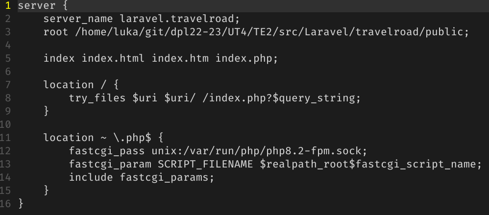
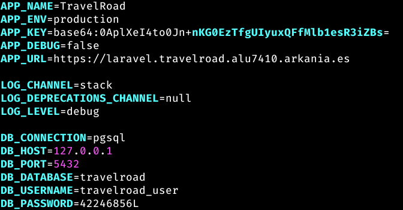
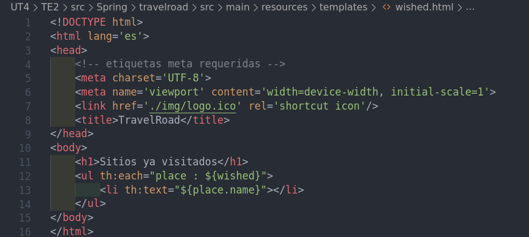
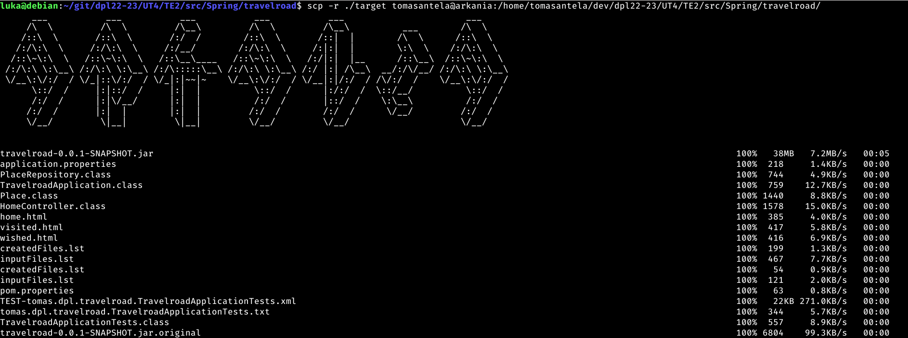
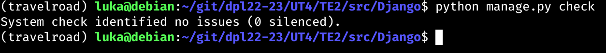

# UT4-TE2: Administración de servidores web
___

## Índice:

1. [Laravel](#te21-laravel)
    - Instalación
        - [Instalación Composer](#instalar-composer)
        - [Instalar Paquetes de Soporte](#instalar-paquetes-de-soporte)
    - Desarrollo
        - [Aplicación - Laravel](#aplicación---laravel)
        - [Configuración Nginx](#configuración-nginx---Laravel)
        - [Lógica de Negocio](#lógica-de-negocio---Laravel)
    - Seguridad
        - [Certificación](#certificación---Laravel)

2. [Express](#te22-express)
    - Instalación
        - [Instalación](#instalación---express)
    - Aplicación
        - [Aplicación](#aplicación---express)
        - [Configuración de base de datos](#configuración-base-de-datos---express)
        - [Lógica de negocio](#lógica-de-negocio---express)
    - Despliegue
        - [Gestión de procesos](#gestionando-procesos---express)
        - [Configuración de Nginx](#configuración-de-nginx---express)
        - [Script de Despliegue](#script-de-despliegue---express)
    - Seguridad
        - [Certificación](#certificación---express)

3. [Spring](#te23-spring)
    - Instalación
        - [JDK](#jdk)
        - [SDKMAN](#sdkman)
        - [Spring-Boot](#spring-boot)
        - [Maven](#maven)
    - Aplicación
        - [Proceso de construcción](#proceso-de-construcción)
        - [Entorno de producción](#entorno-de-producción---spring)
    - Despliegue
        - [Configuración Nginx](#configuración-de-nginx---spring)
        - [Acceso a la aplicación web](#acceso-a-la-aplicación-web---spring)
        - [Script de Despliegue](#script-de-despliegue---spring)
    - Seguridad
        - [Certificación](#certificación---spring)

4. [Django](#te25-django)
    - Instalación
        - [Instalación Python](#instalación---python)
        - [Instalación Django](#instalación---django)
    - Aplicación
        - [Aplicación](#aplicación---django)
            - [Acceso a la base de Datos](#acceso-a-la-base-de-datos---django)

___

## TE2.1 LARAVEL

<div align='center'>


</div>

Laravel es un framework web de código abierto para desarrollar aplicaciones y servicios web con PHP.

### Instalar Composer

Primero deberemos instalar un gestor de dependencias para PHP, Composer:

<div align='center'>

Máquina de Desarrollo


Máquina de Producción


</div>

### Instalar Paquetes de Soporte

Debemos hacer un `sudo apt update`.

Tendremos que instalar unos paquetes de soporte para poder habilitar algunos módulos PHP en el sistema:

<div align='center'>

Máquina de Desarrollo


Máquina de Producción


</div>

### Aplicación - Laravel

Una vez los módulos habilitados y composer instalado, ya podríamos crear el proyecto.

<div align='center'>


</div>

Ahora deberemos comproban si se instalado correctamente artisan, la interfaz en línea de comandos usada en Laravel:

<div align='center'>


</div>

A continuación tendremos en la carpeta del proyecto un archivo de configuración `.env`, en este modificaremos algunos valores para especificar credenciales de acceso a la base de datos. IMPORTANTE NO SUBIR ESTE FICHERO AL CONTROL DE VERSIONES.

```
APP_NAME=TravelRoad
APP_ENV=development
...
DB_CONNECTION=pgsql
DB_HOST=127.0.0.1
DB_PORT=5432
DB_DATABASE=travelroad
DB_USERNAME=travelroad_user
DB_PASSWORD=dpl5757
```

### Configuración Nginx - Laravel

Deberemos fijar unos permisos a los ficheros del proyecto, para que los servicios de Nginx y PHP-FPM puedan acceder a ellos sin problema.

<div align='center'>

Máquina de Desarrollo


Máquina de Producción


</div>

Ahora haremos una configuración de virtual host Nginx para la aplicación que hagamos en Laravel:

<div align='center'>

Máquina de Desarrollo



Máquina de Producción


</div>

Añadí al fichero `/etc/hosts` el host para probar que Laravel esté correctamente desplegado en Nginx. 

Me pasé por `scp` el fichero `.env` (el que tiene las credenciales) para poder configurarlo para la base de datos del servidor de producción.

<div align='center'>


</div>

A continuación voy a configurar el fichero .env en la máquina de producción:

<div align='center'>



</div>

Probamos a conectarnos a [laravel.travelroad.alu7410.arkania](http://laravel.travelroad.alu7410.arkania.es):


<div align='center'>


</div>

### Lógica de negocio - Laravel

A partir de ahora, trabajaremos en la máquina de desarrollo para modificar el comportamiento de la aplicación para cargar los datos y procesarlos (renderizarlos) en una plantilla que nosotros predefinamos.

Modificaremos ahora el fichero de las rutas de `routes/web.php` :

<div align='center'>


</div>

Y ahora escribiremos la plantilla que será en la que imprimiremos los datos. Esta se ubica en la carpeta `resources/views/` y crearemos 3 plantillas: `travelroad.blade.php`, `wished.blade.php` y `visited.blade.php`. En esta indicaremos dónde queremos ver qué valores queremos ver:


<div align='center'>


</div>


Y cuando nos conectamos mediante el navegador nos saldrá algo tal que así:

<div align='center'>


</div>

Con esto ya podremos usar nuestro script para pullear el repositorio en la máquina de producción.

Hay tener en cuenta que la carpeta `vendor` no está incluída en el control de versiones (no preocuparse, ya que el propio framework de Laravel se encarga de añadirlo al gitignore.). Por lo que en la máquina de producción haremos un `composer install` en el proyecto para poder instalar las dependencias necesarias y crear esta carpeta que no se incluye en el control de versiones:

<div align='center'>


</div>

Realizaremos a continuación el script de despliegue [deploy.sh](./src/Laravel/travelroad/deploy.sh)

<div align='center'>


</div>

Y le damos permisos de ejecución al script:

<div align='center'>


</div>

Y lo ejecutamos:

<div align='center'>


</div>

### Certificación - Laravel

A continuación haremos la certificación del virtual host con Certbot:

<div align='center'>


</div>

Haremos restart al servicio de Nginx y ya debería estar certificado:

<div align='center'>


</div>

<div align='center'>


</div>

___

## TE2.2 EXPRESS

<div align='center'>


</div>

Express es un framework web para desarrollar con NodeJS.

### Instalación - Express

En mi caso ya tenía instalado NodeJS y npm en la máquina de Desarrollo, por lo que mostraré el proceso de instalación solo con la máquina de producción.

Primero nos haremos un curl de la última versión de NodeJS y le daremos los permisos de root:

<div align='center'>


</div>

E instalamos NodeJS

<div align='center'>


</div>

### Aplicación - Express

A continuación, conn el gestor de dependencias de NodeJS (npm), instalaremos las dependencias necesarias para poder trabajar con el framework de `Express`.

<div align='center'>


</div>

Ahora si podemos crear nuestro proyecto. Lo crearé en la carpeta [Express](./src/Express/):

<div align='center'>


</div>

El último comando debió generar una estructura de carpetas tal que así:

<div align='center'>


</div>

Por lo que ahora debemos instalar las dependencias necesarias para poder trabajar con express (importante hacerlo dentro de la carpeta del proyecto de express):

<div align='center'>


</div>

Ahora podremos probar la aplicación en el equipo de desarrollo, que abrirá el puerto 3000 para que podamos probar nuestra aplicación:

<div align='center'>


</div>

### Configuración Base de Datos - Express

A continuación configuraremos nuestro proyecto de Express para poder acceder a la base de datos de travelroad montada con PostgreSQL, que para poder acceder a esta, deberemos instalar una dependencia adicional llamada node-postgres. Realizaremos la instalación con nuestro gestor de dependencias `npm`.

<div align='center'>


</div>

Nos interesa guardar las credenciales en un fichero independiente, por lo que trabajaremos con un ficheri `.env` con lo que necesitaremos en el paquete dotenv, paquete que tenemos que instalar también como dependencia:

<div align='center'>


</div>

En el fichero `.env` guardaremos los datos para la conexión a la base de datos. Como en nuestro caso estamos trabajando en la máquina de Desarrollo, usaremos la base de datos que tenemos en la máquina de Desarrollo.

<div align='center'>


Esto habría que hacerlo en la máquina de producción también.

</div>

### Lógica de negocio - Express

Ya tenemos creado nuestro fichero `.env` con las credenciales de nuestra base de datos de desarrollo, a continuación tendremos que configurar la conexión para poder cargar los datos y mostrarlos en una plantilla.

Primero crearemos una carpeta `config` en nuestro proyecto, junto a un fichero llamado `database.js`.

<div align='center'>


Fichero `database.js`


</div>

A continuación gestionaremos las rutas modificando el fichero `routes/index.js`

<div align='center'>


</div>

A continuación crearemos nuestras plantillas deseadas en la ruta `views/` y crearemos los ficheros con las plantillas deseadas. Si nos fijamos en la anterior captura, en donde dice `res.render` introducimos 2 parámetros, el primero es la plantilla que tenemos que procesar y el segundo las variables que queremos "exportar" a la plantilla para poder introducirlos.

Tendremos que hacer la plantilla `index.pug`, `wished.pug` y `visited.pug`.

<div align='center'>

Plantilla Index


Plantilla Wished


Plantilla Visited


</div>

Una vez hemos terminado de diseñar las plantillas para nuestra aplicación, vamos a probar si funcionan correctamente en la máquina de Desarrollo:

<div align='center'>

Salida de terminal:


Web:


</div>

Como podemos apreciar, simplemente falta corregir un pequeño salto de línea de la plantilla

<div align='center'>


Index


Visited


Wished


</div>

### Gestionando Procesos - Express

Si nos fijamos con detalle, para poder poner la aplicación en funcionamiento tenemos que dar de alta a la aplicación desde una terminal y dejar un proceso en la terminal directamente. Esto no es lo idílico, ya que los procesos pueden morir y habría que iniciarlos de nuevo, algo que no es admisible para un servidor web.

A continuación trabajaremos en la máquina de producción para poder configurar un paquete para NodeJS para poder controlar los procesos de nuestra aplicación en NodeJS.

Lo primero será instalar el gestor de procesos, que nosotros usaremos `pm2`.

<div align='center'>


</div>

Ahora accederemos a la carpeta de nuestro proyecto [Express](./src/Express/travelroad) y ejecutamos `pm2`

<div align='center'>


</div>

### Configuración de Nginx - Express

Lo último sería configurar el virtual host en Nginx para conectarnos al proceso de Node.JS

Vamos a crear el virtual host correspondiente para express:

<div align='center'>


</div>

Y ya nos podemos conectar tras haber recargado nginx:

<div align='center'>


</div>

### Script de Despliegue - Express

Tenemos que preparar un script de despliegue que actualize los cambios hechos en el repositorio en nuestra máquina de producción y volver a iniciar el proceso de `pm2`

<div align='center'>


</div>

### Certificación - Express

<div align='center'>


</div>

___

## TE2.3 SPRING

<div align='center'>


</div>

Spring es un framework web para el desarrollo de aplicaciones web en Java.

### Instalación - Spring

#### JDK

Lo primero debemos instalar el Java Development Kit, por lo que primero descargaremos el paquete del OpenJDK:

<div align='center'>

Máquina de Desarrollo


Máquina de Producción


</div>

A continuación descomprimimos el paquete en `/usr/lib/jvm`

<div align='center'>

Máquina de Desarrollo


Máquina de Producción


</div>

Nuestro sistema no sabe dónde tenemos descargados los ejecutables de JAVA, por lo que a continuación deberemos indicarle al sistema dónde tenemos guardados esos ficheros. A continuación modificaremos el fichero `/etc/profile.d/jdk_home.sh`.

<div align='center'>


</div>

Ahora actualizaremos las alternativas para los ejecutables:

<div align='center'>

Máquina de Desarrollo


Máquina de Producción


</div>

Ya tenemos instalados el intérprete de java y su compilador respectivamente.

#### SDKMAN

SDKMAN es una herramienta para la gestión de versiones de kits de desarrollo.

Primero instalaremos el paquete `zip` en el sistema.

<div align='center'>

Máquina de Desarrollo


Máquina de Producción


</div>

SDKMAN nos dan un script de instalación que nos configura todo automáticamente, por lo que simplemente haremos un curl de ese script:

<div align='center'>

Máquina de Desarrollo


Máquina de Producción


</div>

A continuación activamos el punto de entrada:

<div align='center'>

Máquina de Desarrollo


Máquina de Producción


</div>

Ya comprobamos si el SDK está instalado:

<div align='center'>

Máquina de Desarrollo


Máquina de Producción


</div>

#### Spring Boot

Ahora que tenemos instalado SDK, podemos instalar Spring Boot, un subproyecto que nos facilita el despliegue de aplicaciones en producción.

<div align='center'>

Máquina de Desarrollo


Máquina de Producción


</div>

Y comprobamos versión:

<div align='center'>

Máquina de Desarrollo


Máquina de Producción


</div>

#### Maven

Maven es una herramienta para la construcción de proyectos en Java y gestión de las dependencias.

Primero vamos a instalar Maven con SDK:

<div align='center'>

Máquina de Desarrollo


Máquina de Producción


</div>

<div align='center'>

Máquina de Desarrollo


Máquina de Producción


</div>

### Aplicación - Spring

A continuación vamos a crear nuestro proyecto en Spring, por lo que voy a crear el proyecto en la carpeta [src/Spring](./src/Spring/)

<div align='center'>


</div>

Ahora nos dirigiremos a la parte `main` de nuestro proyecto, que es donde escribiremos nuestro código.

Nos crearemos las siguientes carpetas:

| Carpeta | Utilidad |
| --- | --- |
| Controllers | Aquí guardaremos los controladores de nuestro proyecto |
| Models | Aquí guardaremos los modelos de nuestro proyecto |
| Repositories | // PENDIENTE |

Y un fichero para cada carpeta.

<div align='center'>


</div>

Falta añadir las templates wished y visited:

<div align='center'>


</div>


A continuación modificaremos los ficheros que hemos creado:

<div align='center'>

Controlador


Modelo


Repositorio


Templates




</div>

Previamente instalamos Maven, que es nuestro gestor de dependencias. Por tanto debemos definir estas en un fichero llamado [pom.xml](./src/Spring/travelroad/pom.xml).

Para definir las dependencias, debemos acceder al elemento `<dependencies>` y añadir:

```
<dependency>
    <groupId></groupId>
    <artifactId></artifactId>
</dependency>
```

<div align='center'>


</div>

A continuación vamos a incluir las credeniales de nuestra base de datos en el fichero `src/main/resources/application.properties`

<div align='center'>


</div>

#### Proceso de construcción

A continuación deberemos hacer 2 pasos esenciales para poder procesar nuestros proyectos en Java.

Java se trata de un lenguaje compilado e interpretado, un híbrido, ya que debemos compilar los ficheros `.java` para convertirlos en unos ficheros `.class` y así el intérprete de Java pueda procesar estos ficheros.

Teniendo en cuenta lo anterior, observamos que el primer paso es compilar todos estos ficheros. Pero además debemos empaquetar todos estos ficheros compilados en un paquete para reducir almacenamiento y darle mayor unidad a los proyectos.

Entonces nos dirigimos al primer punto, compilar el proyecto. Maven nos trae una herramienta que se llama Maven Wrapper que nos facilita la construcción de los proyectos:

Para compilar el proyecto deberemos hacer un `mvnw compile` en la carpeta del proyecto:

<div align='center'>


</div>

Con esto se nos creara una carpeta `.mvn/wrapper` en el proyecto, por lo que a continuación vamos a empaquetar todo el proyecto.

<div align='center'>


</div>

Tras esto, se nos debería haber generado un fichero en la carpeta [target](./src/Spring/travelroad/target/) del proyecto llamado `travelroad-0.0.1-SNAPSHOT.jar`

<div align='center'>


</div>

Dentro del empaquetado nos incluye un servidor de aplicaciones para Java que se puede usar en producción. Si ejecutamos el fichero empaquetado de nuestro proyecto [travelroad-0.0.1-SNAPSHOT.jar](./src/Spring/travelroad/target/travelroad-0.0.1-SNAPSHOT.jar) podremos acceder al `puerto 8080` en localhost para comprobar que la aplicación funciona con éxito:

<div align='center'>


</div>

Y nos conectamos desde el navegador a `localhost:8080` y comprobamos que la aplicación se ejecutó con éxito:

<div align='center'>


</div>

### Entorno de Producción - Spring

A continuación generaremos un script que nos facilite la ejecución de nuestra aplicación web:

<div align='center'>


</div>

Y le tenemos que dar permisos de ejecución:

<div align='center'>


</div>

Una cosa importante, tras hacernos un pull a nuestra máquina de producción, deberíamos hacer un envío del fichero de credenciales.

<div align='center'>


</div>

Adicionalmente, he modificado las credenciales a las que tengo en la máquina de producción.

Ahora en la máquina de producción generaremos un fichero de servicio para poder gestionarlo mediante systemd:

<div align='center'>

Máquina de Desarrollo


Máquina de Producción


</div>

A continuación deberemos habilitar el servicio para que se arranque automáticamente:

<div align='center'>


</div>

En mi caso a la hora de intentar arrancar el servicio me da error porque me falta la carpeta target (incluída en el [.gitignore](./src/Spring/travelroad/.gitignore))

<div align='center'>


</div>

Por lo que nos vamos a pasar por SCP la carpeta target para poder ejecutar nuestra app.

<div align='center'>



</div>

Y en un principio debería de ejecutarse bien el servicio:

<div align='center'>


</div>

### Configuración de Nginx - Spring

Ya simplemente nos falta configurar Nginx y así podemos tener la aplicación disponible:

<div align='center'>


</div>

y hacemos un reload del servicio de Nginx:

<div align='center'>


</div>

### Acceso a la aplicación web - Spring

Por alguna razón, al ejecutar el servicio de travelroad en spring, en lo que tarda en abrir el servidor de tomcat consume un alto % de la CPU, por lo que el sistema da un error al sistema:

<div align='center'>


</div>

Intenté solucionarlo de distintas maneras, bajando la prioridad o consumo de la app pero sigue saltando error al cabo de 20 segundos de iniciar el servicio.

### Script de Despliegue - Spring

<div align='center'>


</div>

### Certificación - Spring

<div align='center'>


</div>

___

## TE2.4 DJANGO

<div align='center'>


</div>

Django es un framework de desarrollo web para Python.

### Instalación - Python

En mi caso yo ya hice la instalación de `Python` y `pip` en un pasado en ambas máquinas para el despliegue de una interfaz para gestionar nuestra base de datos PostgreSQL.

Pero deberemos instalar el framework de Django:

#### Instalación - Django

Primero abriremos un entorno virtual de python:

<div align='center'>


</div>

A continuación instalamos Django con la herramienta de python `pip` (ya la tenía instalada):

<div align='center'>


</div>

A continuación vamos a crear el proyecto travelroad:

<div align='center'>


</div>

Podremos ejecutar el fichero `manage.py` para ejecutar un servidor de desarrollo en el puerto `8000`:

<div align='center'>


</div>

### Aplicación - Django

A continuación en nuestro proyecto Django crearemos nuestra "aplicación" `places`:

<div align='center'>


</div>

Django de serie no reconoce a `places` como aplicación, por lo que debemos indicarle a este que tome en cuenta a `places` modificando el fichero `main/settings.py`:

<div align='center'>


</div>

#### Acceso a la base de datos - Django

Para poder acceder a la base de datos que tenemos en PostgreSQL, debemos instalar un paquete de soporte denominado psycopg para poder conectar Python con nuestra base de datos.

Cómo ya hicimos la instalación en persona, pues adjunto captura de la verificación de que ya está instalado:

<div align='center'>


</div>

El error parece ser porque en un fichero `.venv/lib/python3.11/site-packages/setuptools/config/setupcfg.py` hay una línea que `license_file` cuando debería poner `license_files`?

Establecemos las credenciales a la base de datos en `main/settings.py`:

<div align='center'>


</div>

Y comprobamos que todo esté correcto:

<div align='center'>


</div>

A continuación haremos el modelo, y el controlador para nuestra aplicación:

<div align='center'>


</div>

A continuación nos creamos una carpeta `places/templates/` y nos crearemos las plantillas que queremos renderizar:

<div align='center'>

Estructura: 


Plantilla Index:


Plantilla Visited:


Plantilla Wished:


</div>

A continuación deberíamos configurar el enrutamiento de nuestro proyecto en el fichero `places/urls.py`:

<div align='center'>


</div>

y enlazarlo con el enrutamiento de nuestro `main/urls.py`:

<div align='center'>


</div>

A continuación compronamos que todo esté instalado correctamente con un `python manage.py check`:


Ahora una vez hemos comprobado que toda la sintaxis está correctamente, vamos a probar a ejecutar nuestro programa en local:

<div align='center'>


</div>

Cómo estamos cambiando entre máquinas, queremos poder modificar las credenciales de la base de datos en el proyecto en función a la máquina en la que estemos trabajando, por lo que deberemos instalar un paquete llamado `prettyconf` que nos permite cargar variables de entorno mediante un fichero de configuración:

<div align='center'>


</div>

Y deberemos añadir al fichero de configuración la siguiente línea:

<div align='center'>


</div>

Y comprobamos que todo esté en orden:

<div align='center'>



</div>

### Especificación de requerimientos

Deberíamos tener un fichero donde marquemos las dependencias de nuestro proyecto, por lo que en la misma carpeta del proyecto simplemente crearemos un fichero `requirements.txt` donde escribiremos las dependencias (django, prettyconf y psycopg2):

<div align='center'>


</div>

### Entorno de producción:

