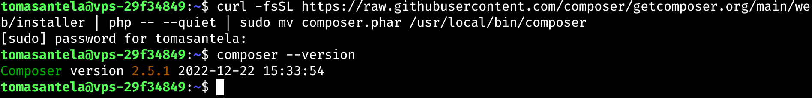
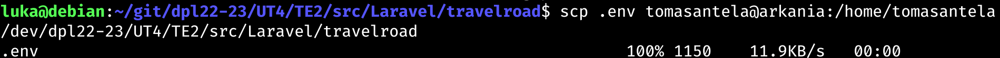

# UT4-TE2: Administración de servidores web
___

## Índice:

1. Laravel
    - Instalación
        - [Instalación Composer](#instalar-composer)
        - [Instalar Paquetes de Soporte](#instalar-paquetes-de-soporte)
    - Desarrollo
        - [Aplicación - Laravel](#aplicación---laravel)
        - [Configuración Nginx](#configuración-nginx---Laravel)
        - [Lógica de Negocio](#lógica-de-negocio---Laravel)
    - Seguridad
        - [Certificación](#certificación---Laravel)
2. Express
    - a
    - a
3. Spring
    - a
    - a
4. Ruby on Rails
    - a
    - a
5. Django
    - a
    - a

___

## TE2.1 LARAVEL

<div align='center'>


</div>

Laravel es un framework web de código abierto para desarrollar aplicaciones y servicios web con PHP.

### Instalar Composer

Primero deberemos instalar un gestor de dependencias para PHP, Composer:

<div align='center'>

Máquina de Desarrollo


Máquina de Producción



</div>

### Instalar Paquetes de Soporte

Debemos hacer un `sudo apt update`.

Tendremos que instalar unos paquetes de soporte para poder habilitar algunos módulos PHP en el sistema:

<div align='center'>

Máquina de Desarrollo


Máquina de Producción


</div>

### Aplicación - Laravel

Una vez los módulos habilitados y composer instalado, ya podríamos crear el proyecto.

<div align='center'>


</div>

Ahora deberemos comproban si se instalado correctamente artisan, la interfaz en línea de comandos usada en Laravel:

<div align='center'>


</div>

A continuación tendremos en la carpeta del proyecto un archivo de configuración `.env`, en este modificaremos algunos valores para especificar credenciales de acceso a la base de datos. IMPORTANTE NO SUBIR ESTE FICHERO AL CONTROL DE VERSIONES.

```
APP_NAME=TravelRoad
APP_ENV=development
...
DB_CONNECTION=pgsql
DB_HOST=127.0.0.1
DB_PORT=5432
DB_DATABASE=travelroad
DB_USERNAME=travelroad_user
DB_PASSWORD=dpl5757
```

### Configuración Nginx - Laravel

Deberemos fijar unos permisos a los ficheros del proyecto, para que los servicios de Nginx y PHP-FPM puedan acceder a ellos sin problema.

<div align='center'>

Máquina de Desarrollo


Máquina de Producción


</div>

Ahora haremos una configuración de virtual host Nginx para la aplicación que hagamos en Laravel:

<div align='center'>

Máquina de Desarrollo


Máquina de Producción


</div>

Añadí al fichero `/etc/hosts` el host para probar que Laravel esté correctamente desplegado en Nginx. 

Me pasé por `scp` el fichero `.env` (el que tiene las credenciales) para poder configurarlo para la base de datos del servidor de producción.

<div align='center'>



</div>

A continuación voy a configurar el fichero .env en la máquina de producción:

<div align='center'>


</div>

Probamos a conectarnos a [laravel.travelroad.alu7410.arkania](http://laravel.travelroad.alu7410.arkania.es):


<div align='center'>


</div>

### Lógica de negocio - Laravel

A partir de ahora, trabajaremos en la máquina de desarrollo para modificar el comportamiento de la aplicación para cargar los datos y procesarlos (renderizarlos) en una plantilla que nosotros predefinamos.

Modificaremos ahora el fichero de las rutas de `routes/web.php` :

<div align='center'>


</div>

Y ahora escribiremos la plantilla que será en la que imprimiremos los datos. Esta se ubica en la carpeta `resources/views/` y crearemos 3 plantillas: `travelroad.blade.php`, `wished.blade.php` y `visited.blade.php`. En esta indicaremos dónde queremos ver qué valores queremos ver:


<div align='center'>


</div>


Y cuando nos conectamos mediante el navegador nos saldrá algo tal que así:

<div align='center'>


</div>

Con esto ya podremos usar nuestro script para pullear el repositorio en la máquina de producción.

Hay tener en cuenta que la carpeta `vendor` no está incluída en el control de versiones (no preocuparse, ya que el propio framework de Laravel se encarga de añadirlo al gitignore.). Por lo que en la máquina de producción haremos un `composer install` en el proyecto para poder instalar las dependencias necesarias y crear esta carpeta que no se incluye en el control de versiones:

<div align='center'>


</div>

Realizaremos a continuación el script de despliegue [deploy.sh](./src/Laravel/travelroad/deploy.sh)

<div align='center'>


</div>

Y le damos permisos de ejecución al script:

<div align='center'>


</div>

Y lo ejecutamos:

<div align='center'>


</div>

### Certificación - Laravel

A continuación haremos la certificación del virtual host con Certbot:

<div align='center'>


</div>

Haremos restart al servicio de Nginx y ya debería estar certificado:

<div align='center'>


</div>

<div align='center'>


</div>

___

## TE2.2 EXPRESS

<div align='center'


</div>

Express es un framework web para desarrollar con NodeJS.

### Instalación - Express

En mi caso ya tenía instalado NodeJS y npm en la máquina de Desarrollo, por lo que mostraré el proceso de instalación solo con la máquina de producción.

Primero nos haremos un curl de la última versión de NodeJS y le daremos los permisos de root:

<div align='center'>


</div>

E instalamos NodeJS

<div align='center'>


</div>

### Aplicación - Express

A continuación, conn el gestor de dependencias de NodeJS (npm), instalaremos las dependencias necesarias para poder trabajar con el framework de `Express`.

<div align='center'>


</div>

Ahora si podemos crear nuestro proyecto. Lo crearé en la carpeta [Express](./src/Express/):

<div align='center'>


</div>

El último comando debió generar una estructura de carpetas tal que así:

<div align='center'>


</div>

Por lo que ahora debemos instalar las dependencias necesarias para poder trabajar con express (importante hacerlo dentro de la carpeta del proyecto de express):

<div align='center'>


</div>

Ahora podremos probar la aplicación en el equipo de desarrollo, que abrirá el puerto 3000 para que podamos probar nuestra aplicación:

<div align='center'>


</div>

### Configuración Base de Datos - Express

A continuación configuraremos nuestro proyecto de Express para poder acceder a la base de datos de travelroad montada con PostgreSQL, que para poder acceder a esta, deberemos instalar una dependencia adicional llamada node-postgres. Realizaremos la instalación con nuestro gestor de dependencias `npm`.

<div align='center'>


</div>

Nos interesa guardar las credenciales en un fichero independiente, por lo que trabajaremos con un ficheri `.env` con lo que necesitaremos en el paquete dotenv, paquete que tenemos que instalar también como dependencia:

<div align='center'>


</div>

En el fichero `.env` guardaremos los datos para la conexión a la base de datos. Como en nuestro caso estamos trabajando en la máquina de Desarrollo, usaremos la base de datos que tenemos en la máquina de Desarrollo.

<div align='center'>


Esto habría que hacerlo en la máquina de producción también.

</div>

### Lógica de negocio - Express

Ya tenemos creado nuestro fichero `.env` con las credenciales de nuestra base de datos de desarrollo, a continuación tendremos que configurar la conexión para poder cargar los datos y mostrarlos en una plantilla.

Primero crearemos una carpeta `config` en nuestro proyecto, junto a un fichero llamado `database.js`.

<div align='center'>


Fichero `database.js`


</div>

A continuación gestionaremos las rutas modificando el fichero `routes/index.js`

<div align='center'>


</div>

A continuación crearemos nuestras plantillas deseadas en la ruta `views/` y crearemos los ficheros con las plantillas deseadas. Si nos fijamos en la anterior captura, en donde dice `res.render` introducimos 2 parámetros, el primero es la plantilla que tenemos que procesar y el segundo las variables que queremos "exportar" a la plantilla para poder introducirlos.

Tendremos que hacer la plantilla `index.pug`, `wished.pug` y `visited.pug`.

<div align='center'>

Plantilla Index


Plantilla Wished


Plantilla Visited


</div>

Una vez hemos terminado de diseñar las plantillas para nuestra aplicación, vamos a probar si funcionan correctamente en la máquina de Desarrollo:

<div align='center'>

Salida de terminal:


Web:


</div>

Como podemos apreciar, simplemente falta corregir un pequeño salto de línea de la plantilla

<div align='center'>


Index


Visited


Wished


</div>

### Gestionando Procesos - Express

Si nos fijamos con detalle, para poder poner la aplicación en funcionamiento tenemos que dar de alta a la aplicación desde una terminal y dejar un proceso en la terminal directamente. Esto no es lo idílico, ya que los procesos pueden morir y habría que iniciarlos de nuevo, algo que no es admisible para un servidor web.

A continuación trabajaremos en la máquina de producción para poder configurar un paquete para NodeJS para poder controlar los procesos de nuestra aplicación en NodeJS.

Lo primero será instalar el gestor de procesos, que nosotros usaremos `pm2`.

<div align='center'>


</div>

Ahora accederemos a la carpeta de nuestro proyecto [Express](./src/Express/travelroad) y ejecutamos `pm2`

<div align='center'>


</div>

### Configuración de Nginx - Express

Lo último sería configurar el virtual host en Nginx para conectarnos al proceso de Node.JS

Vamos a crear el virtual host correspondiente para express:

<div align='center'>


</div>

Y ya nos podemos conectar tras haber recargado nginx:

<div align='center'>


</div>

### Certificación - Express

<div align='center'>


</div>

### Script de Despliegue - Express

Tenemos que preparar un script de despliegue que actualize los cambios hechos en el repositorio en nuestra máquina de producción y volver a iniciar el proceso de `pm2`

<div align='center'>


</div>

___

## TE2.3 SPRING

<div align='center'


</div>

___

## TE2.4 RUBY ON RAILS

<div align='center'


</div>


___

## TE2.5 DJANGO

<div align='center'


</div>

