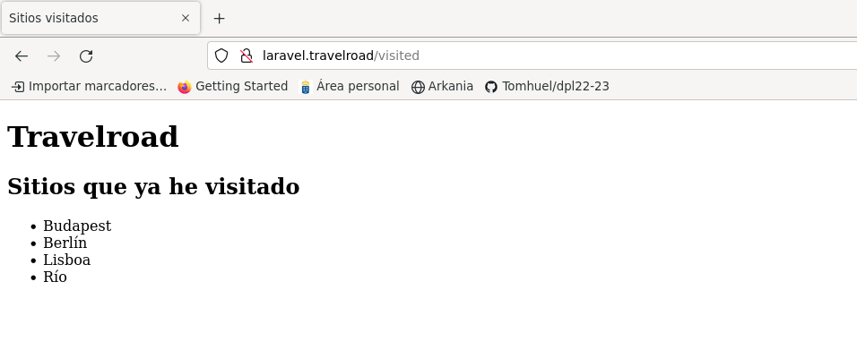

# UT4-TE2: Administración de servidores web
___

## Índice:

1. Laravel
    - a
    - a
2. Express
    - a
    - a
3. Spring
    - a
    - a
4. Ruby on Rails
    - a
    - a
5. Django
    - a
    - a

___

## TE2.1 LARAVEL

<div align='center'>


</div>

Laravel es un framework web de código abierto para desarrollar aplicaciones y servicios web con PHP.

### Instalar Composer

Primero deberemos instalar un gestor de dependencias para PHP, Composer:

<div align='center'>

Máquina de Desarrollo


Máquina de Producción


</div>

### Instalar Paquetes de Soporte

Debemos hacer un `sudo apt update`.

Tendremos que instalar unos paquetes de soporte para poder habilitar algunos módulos PHP en el sistema:

<div align='center'>

Máquina de Desarrollo


Máquina de Producción


</div>

### Aplicación

Una vez los módulos habilitados y composer instalado, ya podríamos crear el proyecto.

<div align='center'>


</div>

Ahora deberemos comproban si se instalado correctamente artisan, la interfaz en línea de comandos usada en Laravel:

<div align='center'>


</div>

A continuación tendremos en la carpeta del proyecto un archivo de configuración `.env`, en este modificaremos algunos valores para especificar credenciales de acceso a la base de datos. IMPORTANTE NO SUBIR ESTE FICHERO AL CONTROL DE VERSIONES.

```
APP_NAME=TravelRoad
APP_ENV=development
...
DB_CONNECTION=pgsql
DB_HOST=127.0.0.1
DB_PORT=5432
DB_DATABASE=travelroad
DB_USERNAME=travelroad_user
DB_PASSWORD=dpl5757
```

### Configuración Nginx

Deberemos fijar unos permisos a los ficheros del proyecto, para que los servicios de Nginx y PHP-FPM puedan acceder a ellos sin problema.

<div align='center'>

Máquina de Desarrollo


Máquina de Producción


</div>

Ahora haremos una configuración de virtual host Nginx para la aplicación que hagamos en Laravel:

<div align='center'>

Máquina de Desarrollo


Máquina de Producción


</div>

Añadí al fichero `/etc/hosts` el host para probar que Laravel esté correctamente desplegado en Nginx. 

Me pasé por `scp` el fichero `.env` (el que tiene las credenciales) para poder configurarlo para la base de datos del servidor de producción.

<div align='center'>


</div>

A continuación voy a configurar el fichero .env en la máquina de producción:

<div align='center'>


</div>

Probamos a conectarnos a [laravel.travelroad.alu7410.arkania](http://laravel.travelroad.alu7410.arkania.es):


<div align='center'>


</div>

### Lógica de negocio

A partir de ahora, trabajaremos en la máquina de desarrollo para modificar el comportamiento de la aplicación para cargar los datos y procesarlos (renderizarlos) en una plantilla que nosotros predefinamos.

Modificaremos ahora el fichero de las rutas de `routes/web.php` :

<div align='center'>


</div>

Y ahora escribiremos la plantilla que será en la que imprimiremos los datos. Esta se ubica en la carpeta `resources/views/` y crearemos 3 plantillas: `travelroad.blade.php`, `wished.blade.php` y `visited.blade.php`. En esta indicaremos dónde queremos ver qué valores queremos ver:


<div align='center'>


</div>


Y cuando nos conectamos mediante el navegador nos saldrá algo tal que así:

<div align='center'>





</div>

A tener en cuenta que la carpeta `vendor` no está incluída en el control de versiones (no preocuparse, ya que el propio framework de Laravel se encarga de añadirlo al gitignore.). Por lo que en la máquina de producción haremos un `composer instal` en el proyecto para poder instalar las dependencias necesarrias y crear esta carpeta que no se incluye en el control de versiones.


___

## TE2.2 EXPRESS

<div align='center'


</div>

___

## TE2.3 SPRING

<div align='center'


</div>

___

## TE2.4 RUBY ON RAILS

<div align='center'


</div>


___

## TE2.5 DJANGO

<div align='center'


</div>

